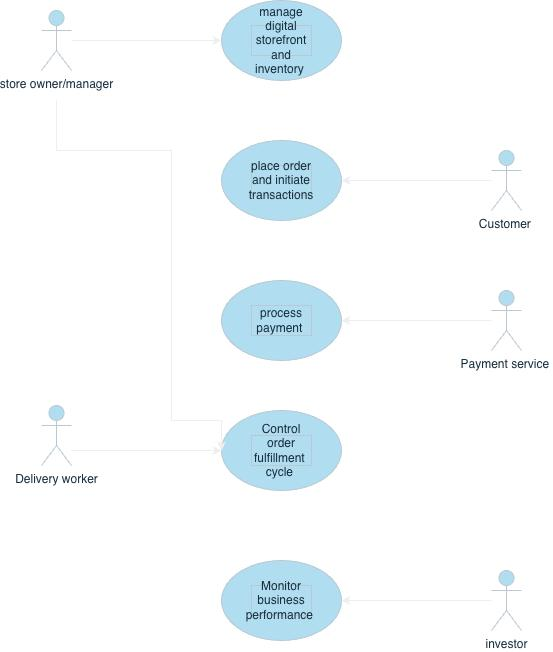
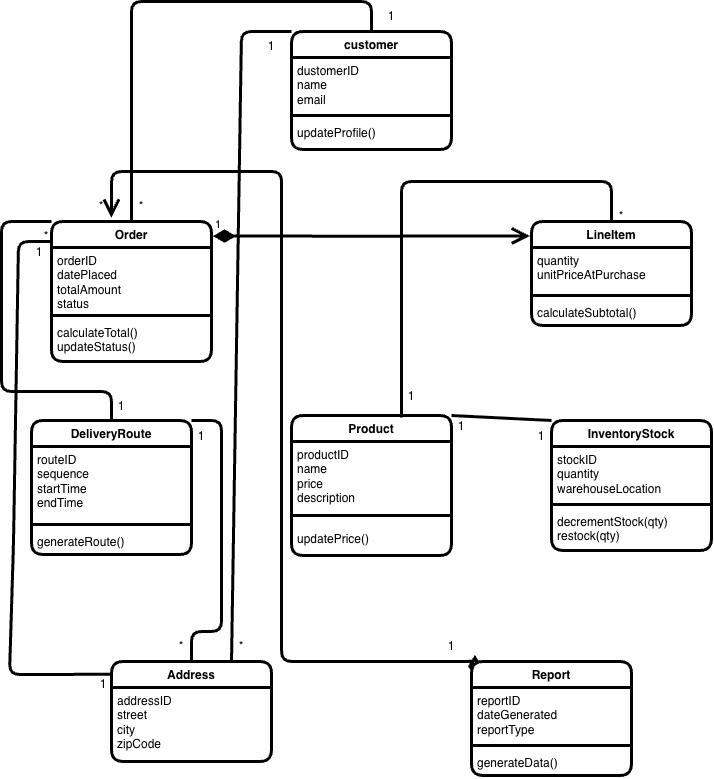
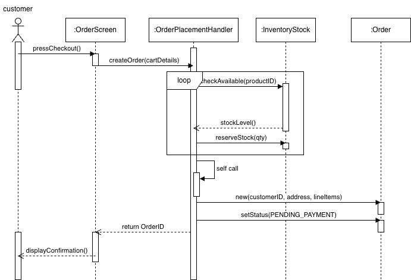
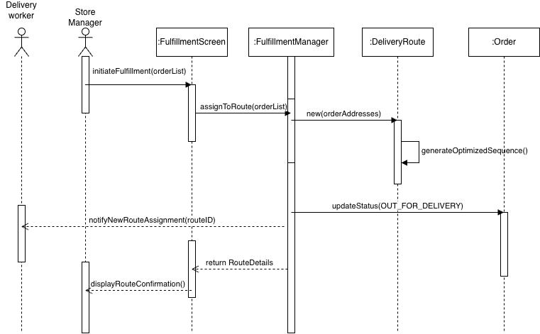
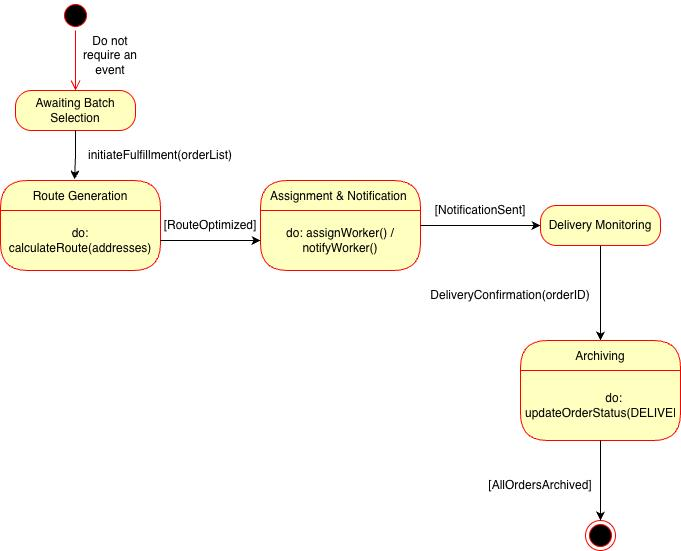
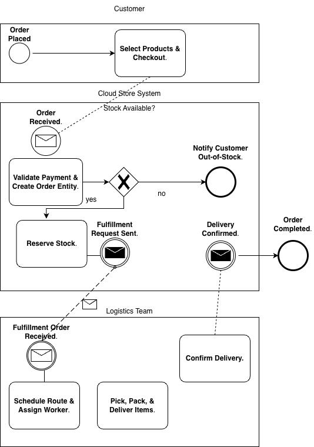
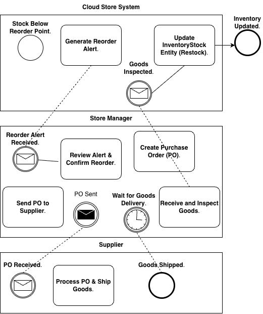

# 💻 Cloud Store — Object-Oriented Software Engineering

Analysis and design of a scalable global e-commerce platform that unifies online shopping with integrated delivery logistics.

*Individual project — all analysis, modeling, and documentation by me.*

## Problem
The grocery and delivery market is fragmented: limited global reach, inconsistent delivery windows, poor stock visibility, and opaque tracking. Businesses struggle with inefficient logistics, global inventory scaling, and a lack of consolidated performance data.

## Solution
A single, highly available platform connecting customers, store managers, delivery workers, a payment service, and investors, covering the full journey from virtual shelf to front door.

## Actors
| Actor | Role |
|---|---|
| Customer | Browses, orders, and pays |
| Store Owner/Manager | Manages inventory, purchase orders, and fulfillment |
| Delivery Worker | Executes final-mile delivery via a mobile app |
| Payment Service | Authorizes transactions through a secure API |
| Investor | Views read-only business reports and KPIs |

## What I Produced
- **Requirements specification:** 18 functional requirements across ordering, payment, inventory, fulfillment, and reporting
- **Non-functional requirements:** security (PCI DSS), transactions under 3 seconds, 99.9% availability, scalability for 500% growth, and 7-year auditability
- **Requirements elicitation:** actor selection and detailed usage scenarios
- **Use case model** defining system scope
- **Analysis object model:** boundary, entity, and control objects
- **Class diagram** of the core domain
- **Dynamic model:** two sequence diagrams and a state machine diagram
- **BPMN models** for order fulfillment and inventory restocking

## Diagrams

### Use Case Model

### Class Diagram

### Sequence Diagram — Place Order & Reserve Stock

### Sequence Diagram — Control Order Fulfillment

### State Machine — Fulfillment Manager

### BPMN — Order Processing & Fulfillment

### BPMN — Inventory Restock Management

## Full Report
📄 [Cloud Store — Analysis & Design Report](Cloud_Store_Report.pdf)
